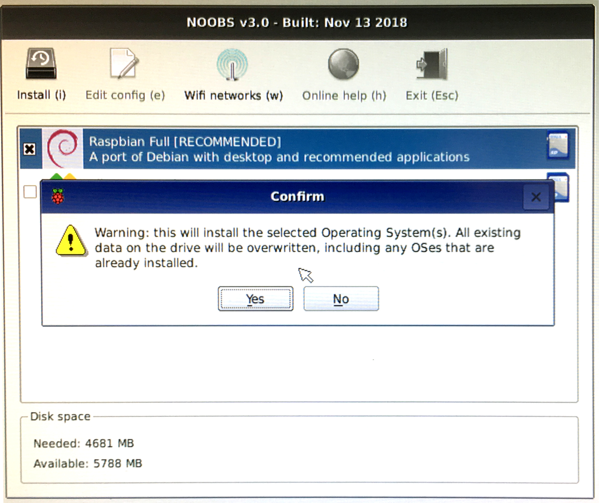

# 01 - Setup

Raspbian Linux ist das offiziell unterstützte Betriebssystem der Raspberry Pi Foundation. In dieser Übung wird das Betriebssystem heruntergeladen auf dem Raspberry Pi installiert.
Dafür wird ein Abbild einer Startfähigen Micro SD Karte auf die SD Karte gespiegelt. Um die Installation so einfach wie möglich zu machen, wird der NOOBS installer angeboten, der diesen Vorgang übernimmt.

## Download NOOBS Installer :computer:

Geht mit eurem Laptop auf [https://raspberrypi.org](https://raspberrypi.org). Unter Downloads findet ihr alle Betriebssysteme, die für das Raspberry Pi verfügbar sind. Wählt NOOBS aus und klickt auf der nächsten Seite "Download ZIP". Achtet darauf, dass ihr nicht versehentlich NOOBS Lite herunterladet.

## NOOBS auf die Micro-SD Karte kopieren

Schliesst euer Kartenlesegerät an den Laptop an und steckt die Micro-SD Karte in den Micro-SD Adapter. Nun den Adapter in das Kartenlesegerät stecken.

Ladet euch das Programm [SD Memory Card Formatter](https://www.sdcard.org/downloads/formatter_4/index.html) herunter und formattiert die Micro-SD Karte. *Achtung: Stellt sicher, dass ihr das richtige Laufwerk ausgewählt habt!*

Auf dem Laptop nun den Ordner der Micro-SD Karte öffnen und den Inhalt des NOOBS ZIP Archivs auf die Micro-SD Karte entpacken.

Anschliessend die Micro-SD Karte in eurem Betriebssystem auswerfen, den Adapter aus dem Kartenleser nehmen und die Micro-SD Karte aus dem Adapter entfernen. Diese wird nun in den Micro-SD Slot eures Raspberry Pi eingesteckt.

:x: 

## Raspberry Pi anschliessen :grapes:

Nachdem die NOOBS Micro-SD Karte in das Raspberry Pi eingesteckt ist, müssen noch eine Maus, eine Tastatur, ein Monitor und ggf. ein Netzwerkkabel angeschlossen werden. Als letztes wird das Stromkabel in den Micro-USB Port gesteckt um das Raspberry Pi zu starten.

Wenn alles klappt, sollte NOOBS euch einem Bildschirm wie folgendem begrüssen.

## Raspbian installieren :grapes:

Mithilfe der NOOBS Oberfläche könnt ihr jetzt mit der Maus Raspbian auswählen und mit einem Klick auf Install auf die Micro-SD Karte installieren. Eventuell müsst ihr noch einmal bestätigen, dass NOOBS Raspbian installieren soll. Der Installer weisst euch hier ein letztes mal darauf hin, dass alle Daten auf der Micro-SD Karte dabei verloren gehen.

Im Anschluss an die Installation sollte das Raspberry Pi automatisch Raspbian starten.

## Raspbian einrichten :grapes:

Raspbian wird euch mit einer intuitiven grafischen Oberfläche begrüssen, wo ihr als erstes ein Passwort setzen sollt. Anschliessend wird euch eine Liste an WLAN Netzwerken gezeigt, um das Raspberry Pi mit dem Internet zu verbinden. Im Anschluss könnt ihr automatisch Updates über das Internet installieren.
